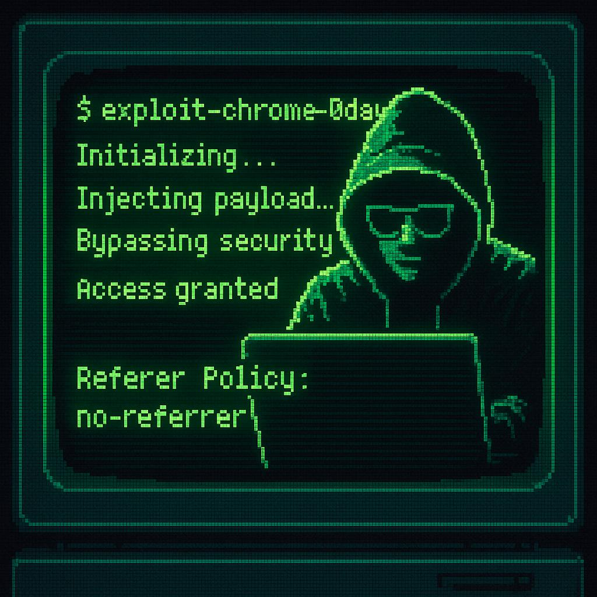

# OAuth Token Leak via Referer Policy Override Demo


## Setup

1. Add to `/etc/hosts`:
```
127.0.0.1       company.tld
127.0.0.1       sso.company.tld
```

2. Install dependencies for SSO and company:
```bash
npm install
```

3. Start the server:
```bash
node index.js
```

Access the application at http://company.tld:3001